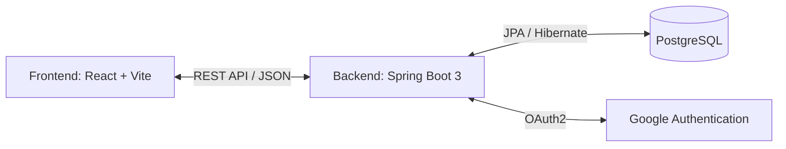

# 🎓 QL-Event-CNPM: Hệ thống Quản lý Sự kiện & Điểm rèn luyện

<div align="center">


**Đồ án môn học Công nghệ Phần mềm - Học viện Công nghệ Bưu chính Viễn thông (PTIT)**  
*Giải pháp số hóa toàn diện quy trình tổ chức sự kiện, đăng ký tham gia, điểm danh và quản lý điểm rèn luyện cho sinh viên.*

</div>

---

## 📑 Mục lục
- [📖 Giới thiệu dự án](#-giới-thiệu-dự-án)
- [✨ Tính năng nổi bật](#-tính-năng-nổi-bật)
- [🏗 Kiến trúc & Công nghệ](#-kiến-trúc--công-nghệ)
- [📂 Cấu trúc thư mục](#-cấu-trúc-thư-mục)
- [🚀 Hướng dẫn cài đặt & Khởi chạy](#-hướng-dẫn-cài-đặt--khởi-chạy)
  - [Cách 1: Chạy nhanh bằng Docker Compose (Khuyên dùng)](#cách-1-chạy-nhanh-bằng-docker-compose-khuyên-dùng)
  - [Cách 2: Cài đặt & Chạy thủ công cho Nhà phát triển](#cách-2-cài-đặt--chạy-thủ-công-cho-nhà-phát-triển)
- [📚 Tài liệu Kỹ thuật & API](#-tài-liệu-kỹ-thuật--api)
- [👥 Phân quyền Người dùng](#-phân-quyền-người-dùng)

---

## 📖 Giới thiệu dự án

Trong môi trường đại học, việc tổ chức và quản lý hàng trăm sự kiện ngoại khóa, hội thảo, hoạt động tình nguyện mỗi kỳ học thường gặp nhiều khó khăn trong khâu theo dõi đăng ký, kiểm soát số lượng tham gia thực tế và tính toán điểm rèn luyện. 

**QL-Event-CNPM** ra đời nhằm giải quyết triệt để các bài toán trên thông qua một nền tảng web hiện đại, cho phép:
- **Nhà trường / Ban tổ chức:** Dễ dàng tạo, quảng bá sự kiện, giới hạn đúng đối tượng tham gia theo khóa/ngành học, phân công cộng tác viên và tự động hóa khâu điểm danh.
- **Sinh viên:** Theo dõi lịch sự kiện trực quan, đăng ký tham gia chỉ với 1 cú nhấp chuột, nhận thông báo kịp thời và theo dõi quỹ điểm rèn luyện tích lũy của bản thân.

---

## ✨ Tính năng nổi bật

### 👨‍🎓 Dành cho Sinh viên (`STUDENT`)
- **Khám phá sự kiện:** Xem danh sách sự kiện đang diễn ra, sắp tới hoặc lọc theo ngành/khóa học của bản thân.
- **Lịch sự kiện trực quan:** Xem lịch trình các hoạt động dưới dạng Calendar chuyên nghiệp.
- **Đăng ký & Hủy đăng ký:** Quản lý vé tham gia sự kiện, tự động kiểm tra điều kiện (khóa, ngành, số lượng tối đa).
- **Check-in tham gia:** Ghi nhận tham gia sự kiện thành công để tích lũy điểm rèn luyện.
- **Thông báo cá nhân:** Nhận thông báo tự động từ ban tổ chức về các thay đổi lịch trình.

### 👔 Dành cho Quản lý / Cộng tác viên (`MANAGER`)
- **Tạo & Quản lý vòng đời sự kiện:** Tạo sự kiện mới, chuyển trạng thái (`DRAFT` -> `PUBLISHED` -> `CLOSED`).
- **Phân định đối tượng tham gia:** Cấu hình target cụ thể cho từng sự kiện (Ví dụ: Chỉ dành cho sinh viên khóa `N23` ngành `CN`).
- **Quản lý Check-in:** Quản lý danh sách sinh viên đã đăng ký và xác nhận điểm danh.
- **Thống kê báo cáo:** Theo dõi tỷ lệ lấp đầy (capacity) và số lượng tham gia thực tế.

### 🛡 Dành cho Quản trị viên (`ADMIN`)
- **Quản lý toàn diện hệ thống:** Quản lý tài khoản người dùng (Sinh viên, Cán bộ), phân quyền hệ thống.
- **Giám sát dữ liệu:** Kiểm soát toàn bộ danh mục sự kiện, cấu hình danh mục và kết xuất báo cáo tổng hợp.

---

## 🏗 Kiến trúc & Công nghệ

Dự án được xây dựng theo mô hình **Client-Server** tách biệt, giao tiếp qua RESTful API đạt chuẩn:



- **Backend (`/backend`):**
  - **Framework:** Java 17+, Spring Boot 3.x (Spring Web, Spring Data JPA, Spring Security).
  - **Bảo mật:** JWT (Access Token & Refresh Token), OAuth2 Google Login.
  - **Cơ sở dữ liệu:** PostgreSQL (Hỗ trợ cấu hình SSL an toàn).
- **Frontend (`/frontend`):**
  - **Framework:** React 18, Vite.
  - **UI/UX:** Tailwind CSS, Lucide Icons, Recharts (Biểu đồ), React Big Calendar.
  - **HTTP Client:** Axios Interceptors xử lý tự động làm mới token.
- **DevOps:** Container hóa đồng bộ với Docker & Docker Compose (Frontend chạy sau Nginx reverse proxy).

---

## 📂 Cấu trúc thư mục

```text
QL-Event-CNPM/
├── backend/               # Mã nguồn Java Spring Boot API
│   ├── src/main/java/...  # Controller, Service, Repository, Entity, DTO, Security
│   ├── Dockerfile         # Cấu hình đóng gói container cho Backend
│   └── pom.xml            # Quản lý thư viện Maven
├── frontend/              # Mã nguồn React Single Page Application (SPA)
│   ├── src/               # Components, Pages, Context, Hooks, Services
│   ├── nginx.conf         # Cấu hình Nginx phục vụ tĩnh & routing
│   └── package.json       # Quản lý thư viện Node.js
├── docs/                  # Tài liệu thiết kế hệ thống, API, ERD Diagram
│   └── image/             # Hình ảnh minh họa đồ án
├── SQL.md                 # Tài liệu mô tả chi tiết lược đồ CSDL (Schema)
└── docker-compose.yml     # Lệnh khởi chạy toàn bộ hệ thống (Web + API)
```

---

## 🚀 Hướng dẫn cài đặt & Khởi chạy

### Cách 1: Chạy nhanh bằng Docker Compose (Khuyên dùng)
Yêu cầu máy tính đã cài đặt **Docker** và **Docker Desktop**.

1. **Clone dự án về máy:**
   ```bash
   git clone https://github.com/your-username/QL-Event-CNPM.git
   cd QL-Event-CNPM
   ```

2. **Cấu hình biến môi trường Backend:**
   Tạo file `backend/.env` từ file mẫu `backend/.env.example` và điền thông tin Database PostgreSQL của bạn:
   ```bash
   cp backend/.env.example backend/.env
   ```

3. **Khởi chạy bằng Docker Compose:**
   ```bash
   docker compose up --build -d
   ```
   - **Frontend:** Truy cập tại địa chỉ `http://localhost:5173`
   - **Backend API:** Truy cập tại địa chỉ `http://localhost:8080`

---

### Cách 2: Cài đặt & Chạy thủ công cho Nhà phát triển

#### 1. Khởi chạy Backend (Spring Boot)
- Yêu cầu: **JDK 17+**, **Maven 3.8+**, **PostgreSQL**.
- Di chuyển vào thư mục backend và cấu hình file `.env`:
  ```bash
  cd backend
  cp .env.example .env
  # Chỉnh sửa DB_URL, DB_USER, DB_PASSWORD, JWT_SECRET trong file .env
  ```
- Chạy ứng dụng bằng Maven:
  ```bash
  mvn spring-boot:run
  ```
  Backend sẽ khởi chạy tại cổng `8080`.

#### 2. Khởi chạy Frontend (React + Vite)
- Yêu cầu: **Node.js 18+**, **npm** hoặc **yarn**.
- Di chuyển vào thư mục frontend và cài đặt thư viện:
  ```bash
  cd frontend
  npm install
  ```
- Tạo file cấu hình môi trường `.env`:
  ```bash
  cp .env.example .env
  # Đảm bảo VITE_API_BASE_URL=http://localhost:8080
  ```
- Khởi chạy server phát triển (Development Server):
  ```bash
  npm run dev
  ```
  Truy cập ứng dụng tại đường dẫn hiển thị trên terminal (mặc định là `http://localhost:5173`).

---

## 📚 Tài liệu Kỹ thuật & API

Dự án cung cấp hệ thống tài liệu kỹ thuật đầy đủ phục vụ việc tìm hiểu kiến trúc và tích hợp:
- [📜 Mô tả Lược đồ Cơ sở dữ liệu (SQL Schema)](SQL.md)
- [📖 Tài liệu đặc tả API (API Documentation)](docs/API_DOCUMENTATION.md)
- [📊 Sơ đồ thực thể kết hợp (Database ERD)](docs/DATABASE_ERD.md)
- [📐 Sơ đồ Chen ERD](docs/CHEN_ERD_DIAGRAM.md)
- [📋 Danh sách API chi tiết (CSV)](docs/api_list.csv)

---

## 👥 Phân quyền Người dùng

| Vai trò | Quyền hạn chính |
| :--- | :--- |
| **`STUDENT`** | Xem danh sách sự kiện, đăng ký/hủy đăng ký, xem lịch cá nhân, nhận thông báo, xem điểm rèn luyện tích lũy. |
| **`MANAGER`** | Tạo và quản lý sự kiện được phân công, cấu hình đối tượng tham gia, duyệt đăng ký, điểm danh (check-in) sinh viên. |
| **`ADMIN`** | Toàn quyền hệ thống, quản lý tài khoản, cấu hình tham số, kết xuất báo cáo thống kê toàn trường. |

---

<div align="center">
  <b>Phát triển bởi nhóm sinh viên thực hiện Đồ án Công nghệ Phần mềm - PTIT</b>
</div>
