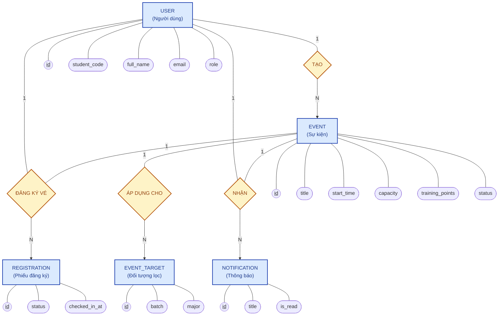

# 💠 Sơ đồ Quan hệ Thực thể theo chuẩn Chen (Chen Notation ERD)

Sơ đồ dưới đây mô tả cấu trúc cơ sở dữ liệu theo mô hình truyền thống Chen Notation:
- **Thực thể (Entity)**: Thể hiện bằng **Ô vuông (Rectangle)** màu xanh dương.
- **Mối quan hệ (Relationship)**: Thể hiện bằng **Hình thoi (Diamond)** màu vàng cam.
- **Thuộc tính (Attribute)**: Thể hiện bằng **Hình bầu dục / Ô tròn (Oval)** (Thuộc tính gạch chân `id` là Khóa chính).

---

