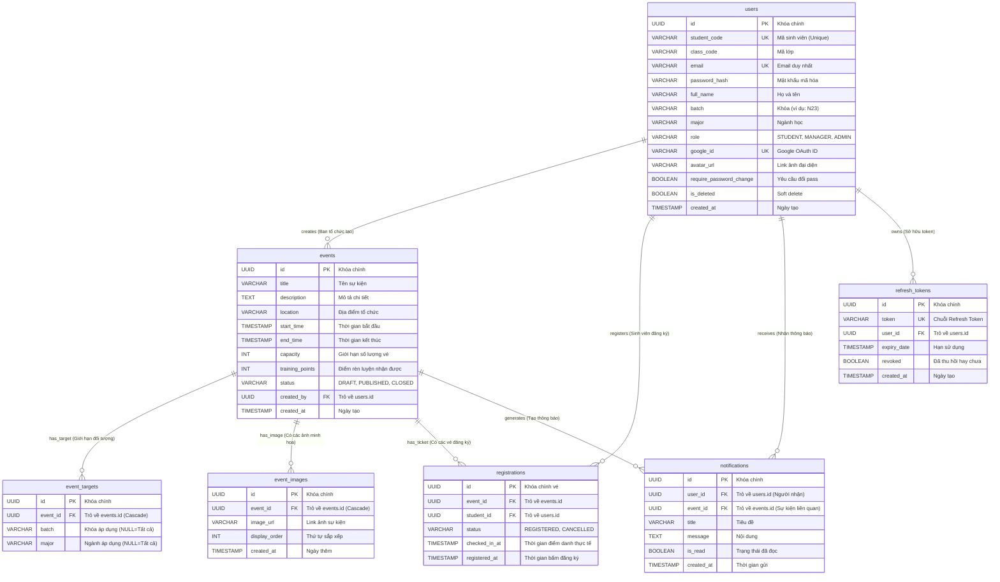

# 🗄️ Sơ đồ Thực thể Liên kết (Entity Relationship Diagram - ERD)

Tài liệu này mô tả chi tiết kiến trúc cơ sở dữ liệu quan hệ (PostgreSQL) của hệ thống Quản lý Sự kiện PTIT, bao gồm sơ đồ ERD trực quan và giải thích các mối quan hệ.

---

## 🎨 1. Sơ đồ ERD (Mermaid)

---

## 🔗 2. Bảng tổng hợp Mối quan hệ & Khóa ngoại (Cardinality)

| Bảng Nguồn (Parent) | Quan hệ | Bảng Đích (Child) | Khóa Ngoại (FK) | Mô tả nghiệp vụ | Ràng buộc xóa (On Delete) |
|:---|:---:|:---|:---|:---|:---|
| `users` | **1 : N** | `events` | `events.created_by` | Một cán bộ quản lý có thể tạo nhiều sự kiện. | `NO ACTION` (Soft delete user) |
| `users` | **1 : N** | `registrations` | `registrations.student_id`| Một sinh viên có thể đăng ký nhiều sự kiện khác nhau. | `CASCADE` |
| `events` | **1 : N** | `registrations` | `registrations.event_id` | Một sự kiện có tối đa `capacity` lượt đăng ký. | `CASCADE` |
| `events` | **1 : N** | `event_targets` | `event_targets.event_id` | Một sự kiện có thể nhắm tới nhiều mốc Khóa/Ngành cụ thể. | `CASCADE` |
| `events` | **1 : N** | `event_images` | `event_images.event_id` | Một sự kiện có thể có nhiều ảnh trình diễn Carousel. | `CASCADE` |
| `users` | **1 : N** | `notifications` | `notifications.user_id` | Một người dùng nhận nhiều thông báo cá nhân. | `CASCADE` |
| `events` | **1 : N** | `notifications` | `notifications.event_id`| Một sự kiện có thể sinh ra nhiều thông báo nhắc nhở. | `CASCADE` |
| `users` | **1 : N** | `refresh_tokens`| `refresh_tokens.user_id`| Quản lý phiên đăng nhập hợp lệ trên các thiết bị. | `CASCADE` |

---

## 🛡️ 3. Các ràng buộc duy nhất cốt lõi (Unique Constraints)
1. **`users(email)` & `users(student_code)` & `users(google_id)`**: Đảm bảo mỗi tài khoản là duy nhất trên toàn hệ thống.
2. **`registrations(event_id, student_id)`**: Ràng buộc composite ngăn chặn sinh viên bấm đăng ký nhận 2 vé cho cùng 1 sự kiện.
3. **`event_targets(event_id, batch, major)`**: Tránh bị trùng lặp bộ quy tắc lọc đối tượng cho cùng 1 sự kiện.
